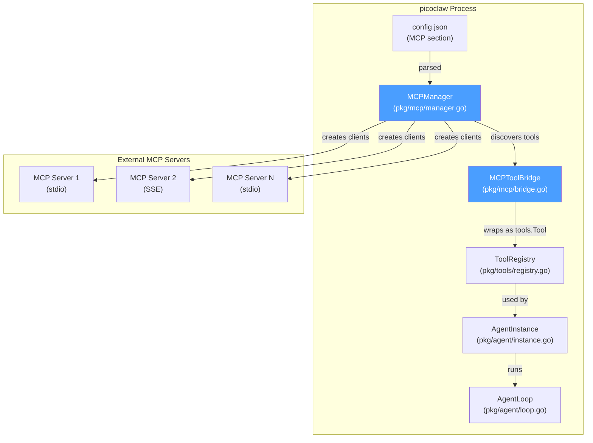
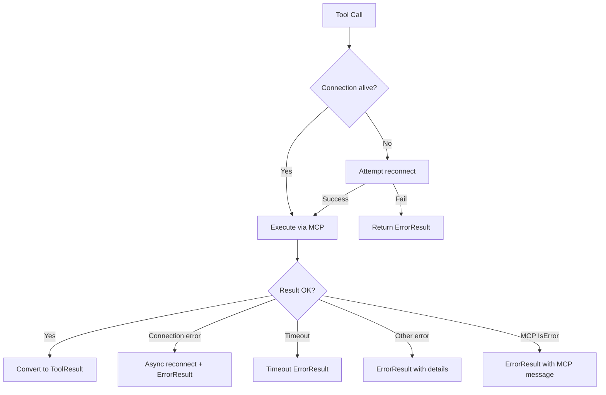

# MCP (Model Context Protocol) Support — Implementation Design

**Status:** Draft  
**Author:** Architecture session  
**Date:** 2026-03-01  
**Target:** picoclaw `v0.next`

---

## Table of Contents

1. [Overview](#1-overview)
2. [Architecture Diagram](#2-architecture-diagram)
3. [Dependency Selection](#3-dependency-selection)
4. [Config Schema](#4-config-schema)
5. [New Files to Create](#5-new-files-to-create)
6. [Existing Files to Modify](#6-existing-files-to-modify)
7. [MCP Client Lifecycle](#7-mcp-client-lifecycle)
8. [Tool Bridging](#8-tool-bridging)
9. [Per-Agent MCP Config](#9-per-agent-mcp-config)
10. [Transport Support](#10-transport-support)
11. [Error Handling & Resilience](#11-error-handling--resilience)
12. [Integration Points](#12-integration-points)
13. [Testing Strategy](#13-testing-strategy)
14. [Migration & Rollout](#14-migration--rollout)

---

## 1. Overview

picoclaw currently has a custom tool system built around the `tools.Tool` interface. MCP (Model Context Protocol) is an open standard that enables AI agents to connect to external tools and data sources via a standardized protocol.

This design adds **MCP client** support to picoclaw, allowing agents to:
- Connect to external MCP servers (filesystem, database, API tools, etc.)
- Discover and call MCP-provided tools as if they were native picoclaw tools
- Configure per-agent MCP server connections
- Support both **stdio** and **SSE/StreamableHTTP** transports

### Non-Goals (this iteration)
- picoclaw acting as an MCP **server** (exposing its own tools via MCP)
- MCP resource/prompt support (tools only for v1)
- Dynamic tool list change notifications (v2)

---

## 2. Architecture Diagram



```mermaid
sequenceDiagram
    participant Startup as cmd_agent.go
    participant Manager as MCPManager
    participant Client as mcp-go Client
    participant Server as MCP Server (external)
    participant Registry as ToolRegistry
    participant Loop as Agent Loop
    participant LLM as LLM Provider

    Startup->>Manager: NewMCPManager(configs)
    Manager->>Client: NewStdioMCPClient(cmd, args)
    Client->>Server: Spawn subprocess
    Client->>Server: initialize (protocol handshake)
    Server-->>Client: ServerInfo + capabilities
    Client->>Server: tools/list
    Server-->>Client: []Tool definitions
    Manager->>Registry: Register(MCPToolBridge) for each tool
    
    Note over Loop, LLM: Normal agent loop begins
    LLM-->>Loop: tool_call: "mcp__server__toolname"
    Loop->>Registry: ExecuteWithContext("mcp__server__toolname", args)
    Registry->>Client: CallTool(toolname, args)
    Client->>Server: tools/call {name, arguments}
    Server-->>Client: CallToolResult
    Client-->>Registry: ToolResult
    Registry-->>Loop: ToolResult.ForLLM
    Loop->>LLM: tool result message
    
    Note over Startup, Server: Shutdown
    Startup->>Manager: Shutdown(ctx)
    Manager->>Client: Close()
    Client->>Server: Kill subprocess / close SSE
```

---

## 3. Dependency Selection

### Recommended: `github.com/mark3labs/mcp-go`

| Criteria | mark3labs/mcp-go | modelcontextprotocol/go-sdk |
|----------|-----------------|---------------------------|
| Maturity | High — widely adopted, 580+ code snippets | Medium — official but newer |
| Spec version | 2025-11-25 (latest) + backward compat | 2025-11-25 |
| Client API | Well-documented `client.NewStdioMCPClient()`, `client.NewClient()` | `mcp.NewClient()` |
| Transports | stdio, SSE, StreamableHTTP | stdio, StreamableHTTP |
| Benchmark score | 81.8 (high) | 59.9 |
| Source reputation | High | High |

**Decision:** Use `mark3labs/mcp-go` for its mature client API, comprehensive transport support, and broader community adoption.

### go.mod addition

```
require (
    github.com/mark3labs/mcp-go v0.28.0  // or latest stable
)
```

---

## 4. Config Schema

### 4.1 Top-Level Config Addition

Add `MCP` field to `ToolsConfig` in `pkg/config/config.go`:

```go
type ToolsConfig struct {
    Web    WebToolsConfig    `json:"web"`
    Cron   CronToolsConfig   `json:"cron"`
    Exec   ExecConfig        `json:"exec"`
    Skills SkillsToolsConfig `json:"skills"`
    MCP    MCPConfig         `json:"mcp"`     // NEW
}
```

### 4.2 MCP Config Types

```go
// MCPConfig holds configuration for MCP (Model Context Protocol) servers.
type MCPConfig struct {
    // Servers maps server names to their configurations.
    // The key is used as a prefix for tool names: "mcp__<server>__<tool>".
    Servers map[string]MCPServerConfig `json:"servers"`
}

// MCPServerConfig configures a single MCP server connection.
type MCPServerConfig struct {
    // Transport type: "stdio" or "sse"
    Transport string `json:"transport"`

    // Command is the executable to run (stdio transport only).
    Command string `json:"command,omitempty"`

    // Args are command-line arguments (stdio transport only).
    Args []string `json:"args,omitempty"`

    // Env are additional environment variables (stdio transport only).
    // Format: ["KEY=VALUE", ...]
    Env []string `json:"env,omitempty"`

    // URL is the SSE/StreamableHTTP endpoint (sse transport only).
    URL string `json:"url,omitempty"`

    // Headers are additional HTTP headers (sse transport only).
    // Format: {"Authorization": "Bearer token"}
    Headers map[string]string `json:"headers,omitempty"`

    // Enabled controls whether this server is active. Defaults to true.
    Enabled *bool `json:"enabled,omitempty"`

    // Timeout is the maximum time (in seconds) to wait for tool calls.
    // 0 means default (60s).
    Timeout int `json:"timeout,omitempty"`

    // MaxRetries is the number of reconnection attempts on failure.
    // 0 means default (3).
    MaxRetries int `json:"max_retries,omitempty"`
}
```

### 4.3 Per-Agent MCP Config

```go
type AgentConfig struct {
    // ... existing fields ...
    MCPServers []string `json:"mcp_servers,omitempty"` // NEW: list of server names from tools.mcp.servers
}
```

### 4.4 Example config.json

```json
{
  "tools": {
    "mcp": {
      "servers": {
        "filesystem": {
          "transport": "stdio",
          "command": "npx",
          "args": ["-y", "@modelcontextprotocol/server-filesystem", "/home/user/docs"],
          "timeout": 30
        },
        "github": {
          "transport": "stdio",
          "command": "npx",
          "args": ["-y", "@modelcontextprotocol/server-github"],
          "env": ["GITHUB_PERSONAL_ACCESS_TOKEN=ghp_xxx"]
        },
        "database": {
          "transport": "sse",
          "url": "http://localhost:3001/sse",
          "headers": {
            "Authorization": "Bearer my-token"
          },
          "timeout": 120
        },
        "disabled-server": {
          "transport": "stdio",
          "command": "some-server",
          "enabled": false
        }
      }
    }
  },
  "agents": {
    "list": [
      {
        "id": "main",
        "default": true,
        "mcp_servers": ["filesystem", "github"]
      },
      {
        "id": "coder",
        "mcp_servers": ["filesystem", "github", "database"]
      }
    ]
  }
}
```

---

## 5. New Files to Create

### 5.1 `pkg/mcp/manager.go` — MCP Connection Manager

**Purpose:** Manages lifecycle of all MCP server connections. Creates clients, initializes connections, discovers tools, handles shutdown.

```go
package mcp

import (
    "context"
    "fmt"
    "sync"
    "time"

    mcpclient "github.com/mark3labs/mcp-go/client"
    "github.com/mark3labs/mcp-go/client/transport"
    mcpgo "github.com/mark3labs/mcp-go/mcp"
    "github.com/sipeed/picoclaw/pkg/config"
    "github.com/sipeed/picoclaw/pkg/logger"
)

// ServerConnection holds a live connection to an MCP server.
type ServerConnection struct {
    Name       string
    Client     mcpclient.MCPClient
    Tools      []mcpgo.Tool
    Config     config.MCPServerConfig
    mu         sync.RWMutex
    connected  bool
    lastError  error
}

// Manager manages all MCP server connections.
type Manager struct {
    connections map[string]*ServerConnection
    mu          sync.RWMutex
}

// NewManager creates an MCP manager and connects to all enabled servers.
func NewManager(ctx context.Context, mcpCfg config.MCPConfig) (*Manager, error)

// GetConnection returns a server connection by name.
func (m *Manager) GetConnection(name string) (*ServerConnection, bool)

// GetTools returns all discovered tools across all connected servers.
// Returns a map of serverName → []mcpgo.Tool.
func (m *Manager) GetTools() map[string][]mcpgo.Tool

// GetToolsForServers returns tools only for the specified server names.
func (m *Manager) GetToolsForServers(serverNames []string) map[string][]mcpgo.Tool

// CallTool calls a tool on a specific server.
func (m *Manager) CallTool(
    ctx context.Context, 
    serverName, toolName string, 
    args map[string]any,
) (*mcpgo.CallToolResult, error)

// Shutdown gracefully closes all MCP connections.
func (m *Manager) Shutdown(ctx context.Context) error

// Reconnect attempts to reconnect a specific server.
func (m *Manager) Reconnect(ctx context.Context, serverName string) error

// connectServer creates and initializes a single server connection.
func (m *Manager) connectServer(
    ctx context.Context, 
    name string, 
    cfg config.MCPServerConfig,
) (*ServerConnection, error)

// initializeClient performs the MCP protocol handshake.
func initializeClient(
    ctx context.Context, 
    c mcpclient.MCPClient,
) (*mcpgo.InitializeResult, error)

// discoverTools lists all tools from a connected server.
func discoverTools(
    ctx context.Context, 
    c mcpclient.MCPClient,
) ([]mcpgo.Tool, error)
```

**Key implementation details:**

```go
func (m *Manager) connectServer(
    ctx context.Context,
    name string,
    cfg config.MCPServerConfig,
) (*ServerConnection, error) {
    timeout := time.Duration(cfg.Timeout) * time.Second
    if timeout == 0 {
        timeout = 60 * time.Second
    }

    connCtx, cancel := context.WithTimeout(ctx, 30*time.Second)
    defer cancel()

    var c mcpclient.MCPClient
    var err error

    switch cfg.Transport {
    case "stdio":
        c, err = mcpclient.NewStdioMCPClient(
            cfg.Command,
            cfg.Env,
            cfg.Args...,
        )
    case "sse":
        c, err = mcpclient.NewSSEMCPClient(cfg.URL,
            mcpclient.WithHeaders(cfg.Headers),
        )
    default:
        return nil, fmt.Errorf("unsupported transport: %s", cfg.Transport)
    }

    if err != nil {
        return nil, fmt.Errorf("failed to create MCP client for %q: %w", name, err)
    }

    // Initialize protocol
    initResult, err := initializeClient(connCtx, c)
    if err != nil {
        c.Close()
        return nil, fmt.Errorf("failed to initialize MCP server %q: %w", name, err)
    }

    logger.InfoCF("mcp", "Connected to MCP server",
        map[string]any{
            "server":  name,
            "name":    initResult.ServerInfo.Name,
            "version": initResult.ServerInfo.Version,
        })

    // Discover tools
    tools, err := discoverTools(connCtx, c)
    if err != nil {
        c.Close()
        return nil, fmt.Errorf("failed to discover tools from %q: %w", name, err)
    }

    logger.InfoCF("mcp", "Discovered MCP tools",
        map[string]any{
            "server":     name,
            "tool_count": len(tools),
        })

    return &ServerConnection{
        Name:      name,
        Client:    c,
        Tools:     tools,
        Config:    cfg,
        connected: true,
    }, nil
}
```

---

### 5.2 `pkg/mcp/bridge.go` — MCP-to-picoclaw Tool Bridge

**Purpose:** Wraps MCP tools as picoclaw `tools.Tool` implementations so they appear in the `ToolRegistry`.

```go
package mcp

import (
    "context"
    "fmt"
    "strings"
    "time"

    mcpgo "github.com/mark3labs/mcp-go/mcp"
    "github.com/sipeed/picoclaw/pkg/logger"
    "github.com/sipeed/picoclaw/pkg/tools"
)

// ToolNamePrefix is prepended to MCP tool names to avoid collisions.
// Format: "mcp__<server>__<tool>"
const ToolNamePrefix = "mcp"
const ToolNameSeparator = "__"

// MCPToolBridge wraps an MCP tool as a picoclaw tools.Tool.
type MCPToolBridge struct {
    serverName string
    mcpTool    mcpgo.Tool
    manager    *Manager
    timeout    time.Duration
}

// NewMCPToolBridge creates a new bridge for an MCP tool.
func NewMCPToolBridge(
    serverName string,
    mcpTool mcpgo.Tool,
    manager *Manager,
    timeout time.Duration,
) *MCPToolBridge {
    return &MCPToolBridge{
        serverName: serverName,
        mcpTool:    mcpTool,
        manager:    manager,
        timeout:    timeout,
    }
}

// Name returns the namespaced tool name: "mcp__<server>__<original_name>"
func (b *MCPToolBridge) Name() string {
    return fmt.Sprintf("%s%s%s%s%s",
        ToolNamePrefix, ToolNameSeparator,
        b.serverName, ToolNameSeparator,
        b.mcpTool.Name)
}

// Description returns the MCP tool's description with a server attribution.
func (b *MCPToolBridge) Description() string {
    desc := b.mcpTool.Description
    if desc == "" {
        desc = fmt.Sprintf("MCP tool from %s server", b.serverName)
    }
    return fmt.Sprintf("[MCP:%s] %s", b.serverName, desc)
}

// Parameters converts the MCP tool's JSON Schema InputSchema to
// picoclaw's map[string]any format.
func (b *MCPToolBridge) Parameters() map[string]any {
    // mcp-go Tool.InputSchema is already a JSON Schema object
    // which is compatible with picoclaw's parameter format.
    schema := make(map[string]any)
    
    if b.mcpTool.InputSchema.Type != "" {
        schema["type"] = b.mcpTool.InputSchema.Type
    } else {
        schema["type"] = "object"
    }
    
    if b.mcpTool.InputSchema.Properties != nil {
        schema["properties"] = b.mcpTool.InputSchema.Properties
    }
    
    if len(b.mcpTool.InputSchema.Required) > 0 {
        schema["required"] = b.mcpTool.InputSchema.Required
    }
    
    return schema
}

// Execute calls the MCP tool via the manager and converts the result.
func (b *MCPToolBridge) Execute(ctx context.Context, args map[string]any) *tools.ToolResult {
    timeout := b.timeout
    if timeout == 0 {
        timeout = 60 * time.Second
    }

    callCtx, cancel := context.WithTimeout(ctx, timeout)
    defer cancel()

    result, err := b.manager.CallTool(callCtx, b.serverName, b.mcpTool.Name, args)
    if err != nil {
        logger.ErrorCF("mcp", "MCP tool call failed",
            map[string]any{
                "server": b.serverName,
                "tool":   b.mcpTool.Name,
                "error":  err.Error(),
            })
        
        // Attempt reconnection if the error suggests connection loss
        if isConnectionError(err) {
            go b.manager.Reconnect(context.Background(), b.serverName)
        }
        
        return tools.ErrorResult(
            fmt.Sprintf("MCP tool %q on server %q failed: %v",
                b.mcpTool.Name, b.serverName, err),
        ).WithError(err)
    }

    // Convert MCP CallToolResult to picoclaw ToolResult
    return convertMCPResult(result)
}

// convertMCPResult converts an MCP CallToolResult to a picoclaw ToolResult.
func convertMCPResult(result *mcpgo.CallToolResult) *tools.ToolResult {
    if result == nil {
        return tools.ErrorResult("MCP tool returned nil result")
    }

    // Extract text content from the result
    var sb strings.Builder
    for _, content := range result.Content {
        switch c := content.(type) {
        case mcpgo.TextContent:
            if sb.Len() > 0 {
                sb.WriteString("\n")
            }
            sb.WriteString(c.Text)
        case *mcpgo.TextContent:
            if sb.Len() > 0 {
                sb.WriteString("\n")
            }
            sb.WriteString(c.Text)
        default:
            // For non-text content, include a description
            if sb.Len() > 0 {
                sb.WriteString("\n")
            }
            sb.WriteString(fmt.Sprintf("[non-text content: %T]", content))
        }
    }

    text := sb.String()
    if text == "" {
        text = "(empty result)"
    }

    // Check if MCP indicated an error
    if result.IsError {
        return tools.ErrorResult(text)
    }

    return tools.NewToolResult(text)
}

// isConnectionError checks if an error indicates a broken connection.
func isConnectionError(err error) bool {
    msg := strings.ToLower(err.Error())
    return strings.Contains(msg, "broken pipe") ||
        strings.Contains(msg, "connection refused") ||
        strings.Contains(msg, "connection reset") ||
        strings.Contains(msg, "eof") ||
        strings.Contains(msg, "transport") ||
        strings.Contains(msg, "closed")
}

// RegisterMCPTools creates MCPToolBridge instances for all discovered tools
// and registers them in the given ToolRegistry.
func RegisterMCPTools(
    manager *Manager,
    registry *tools.ToolRegistry,
    serverNames []string, // nil means all servers
) int {
    var toolsMap map[string][]mcpgo.Tool
    if serverNames == nil {
        toolsMap = manager.GetTools()
    } else {
        toolsMap = manager.GetToolsForServers(serverNames)
    }

    count := 0
    for serverName, mcpTools := range toolsMap {
        conn, ok := manager.GetConnection(serverName)
        if !ok {
            continue
        }
        
        timeout := time.Duration(conn.Config.Timeout) * time.Second
        
        for _, mcpTool := range mcpTools {
            bridge := NewMCPToolBridge(serverName, mcpTool, manager, timeout)
            registry.Register(bridge)
            count++
            
            logger.DebugCF("mcp", "Registered MCP tool",
                map[string]any{
                    "name":        bridge.Name(),
                    "server":      serverName,
                    "original":    mcpTool.Name,
                    "description": mcpTool.Description,
                })
        }
    }
    
    return count
}

// ParseMCPToolName splits a namespaced MCP tool name back into server and tool.
// Returns ("", "", false) if the name is not an MCP tool.
func ParseMCPToolName(name string) (serverName, toolName string, ok bool) {
    parts := strings.SplitN(name, ToolNameSeparator, 3)
    if len(parts) != 3 || parts[0] != ToolNamePrefix {
        return "", "", false
    }
    return parts[1], parts[2], true
}
```

---

### 5.3 `pkg/mcp/manager_test.go` — Unit Tests for Manager

```go
package mcp

import (
    "context"
    "testing"

    "github.com/stretchr/testify/assert"
)

func TestParseMCPToolName(t *testing.T) {
    tests := []struct {
        input      string
        server     string
        tool       string
        ok         bool
    }{
        {"mcp__filesystem__read_file", "filesystem", "read_file", true},
        {"mcp__github__create_issue", "github", "create_issue", true},
        {"mcp__db__query", "db", "query", true},
        {"web_search", "", "", false},
        {"mcp__", "", "", false},
        {"mcp__server", "", "", false},
    }
    for _, tt := range tests {
        server, tool, ok := ParseMCPToolName(tt.input)
        assert.Equal(t, tt.ok, ok, "input: %s", tt.input)
        if ok {
            assert.Equal(t, tt.server, server)
            assert.Equal(t, tt.tool, tool)
        }
    }
}

func TestMCPToolBridge_Name(t *testing.T) {
    // ... test that bridge produces correct namespaced names
}

func TestConvertMCPResult(t *testing.T) {
    // ... test text content extraction, error handling, nil result
}
```

---

### 5.4 `pkg/mcp/bridge_test.go` — Unit Tests for Bridge

```go
package mcp

import (
    "testing"

    mcpgo "github.com/mark3labs/mcp-go/mcp"
    "github.com/stretchr/testify/assert"
)

func TestConvertMCPResult_TextContent(t *testing.T) {
    result := &mcpgo.CallToolResult{
        Content: []mcpgo.Content{
            mcpgo.TextContent{Text: "Hello world"},
        },
    }
    tr := convertMCPResult(result)
    assert.Equal(t, "Hello world", tr.ForLLM)
    assert.False(t, tr.IsError)
}

func TestConvertMCPResult_Error(t *testing.T) {
    result := &mcpgo.CallToolResult{
        Content: []mcpgo.Content{
            mcpgo.TextContent{Text: "Something went wrong"},
        },
        IsError: true,
    }
    tr := convertMCPResult(result)
    assert.True(t, tr.IsError)
    assert.Contains(t, tr.ForLLM, "Something went wrong")
}

func TestConvertMCPResult_Nil(t *testing.T) {
    tr := convertMCPResult(nil)
    assert.True(t, tr.IsError)
}

func TestConvertMCPResult_MultipleContent(t *testing.T) {
    result := &mcpgo.CallToolResult{
        Content: []mcpgo.Content{
            mcpgo.TextContent{Text: "Line 1"},
            mcpgo.TextContent{Text: "Line 2"},
        },
    }
    tr := convertMCPResult(result)
    assert.Equal(t, "Line 1\nLine 2", tr.ForLLM)
}
```

---

## 6. Existing Files to Modify

### 6.1 `pkg/config/config.go` — Add MCP Config Types

**Location:** After `ToolsConfig` struct (line ~484-489)

**Changes:**
1. Add `MCP MCPConfig` field to `ToolsConfig`
2. Add `MCPConfig` and `MCPServerConfig` structs
3. Add `MCPServers []string` field to `AgentConfig`
4. Add `IsEnabled()` helper to `MCPServerConfig`

```go
// In ToolsConfig (line 484):
type ToolsConfig struct {
    Web    WebToolsConfig    `json:"web"`
    Cron   CronToolsConfig   `json:"cron"`
    Exec   ExecConfig        `json:"exec"`
    Skills SkillsToolsConfig `json:"skills"`
    MCP    MCPConfig         `json:"mcp"`     // ADD THIS LINE
}

// In AgentConfig (line 131):
type AgentConfig struct {
    ID                string            `json:"id"`
    Default           bool              `json:"default,omitempty"`
    Name              string            `json:"name,omitempty"`
    Workspace         string            `json:"workspace,omitempty"`
    Model             *AgentModelConfig `json:"model,omitempty"`
    Skills            []string          `json:"skills,omitempty"`
    Subagents         *SubagentsConfig  `json:"subagents,omitempty"`
    MaxTokens         int               `json:"max_tokens,omitempty"`
    Temperature       *float64          `json:"temperature,omitempty"`
    MaxToolIterations int               `json:"max_tool_iterations,omitempty"`
    ThinkingBudget    int               `json:"thinking_budget,omitempty"`
    ContextWindow     int               `json:"context_window,omitempty"`
    MCPServers        []string          `json:"mcp_servers,omitempty"` // ADD THIS LINE
}

// ADD NEW TYPES (after ToolsConfig):

// MCPConfig holds configuration for MCP (Model Context Protocol) servers.
type MCPConfig struct {
    Servers map[string]MCPServerConfig `json:"servers,omitempty"`
}

// MCPServerConfig configures a single MCP server connection.
type MCPServerConfig struct {
    Transport  string            `json:"transport"`
    Command    string            `json:"command,omitempty"`
    Args       []string          `json:"args,omitempty"`
    Env        []string          `json:"env,omitempty"`
    URL        string            `json:"url,omitempty"`
    Headers    map[string]string `json:"headers,omitempty"`
    Enabled    *bool             `json:"enabled,omitempty"`
    Timeout    int               `json:"timeout,omitempty"`
    MaxRetries int               `json:"max_retries,omitempty"`
}

// IsEnabled returns whether the server is enabled (defaults to true).
func (c *MCPServerConfig) IsEnabled() bool {
    if c.Enabled == nil {
        return true
    }
    return *c.Enabled
}

// Validate checks the MCPServerConfig for required fields.
func (c *MCPServerConfig) Validate() error {
    switch c.Transport {
    case "stdio":
        if c.Command == "" {
            return fmt.Errorf("stdio transport requires 'command'")
        }
    case "sse":
        if c.URL == "" {
            return fmt.Errorf("sse transport requires 'url'")
        }
    default:
        return fmt.Errorf("unsupported transport: %q (use 'stdio' or 'sse')", c.Transport)
    }
    return nil
}
```

---

### 6.2 `pkg/config/defaults.go` — Add MCP Defaults

**Location:** Inside `DefaultConfig()` function, within the `Tools:` block (line ~278-319)

**Change:** Add empty MCP config after `Skills`:

```go
// After Skills: SkillsToolsConfig{...}, (line 318)
MCP: MCPConfig{
    Servers: map[string]MCPServerConfig{},
},
```

---

### 6.3 `pkg/agent/instance.go` — Store MCP Server List

**Location:** `AgentInstance` struct (line 17-36) and `NewAgentInstance` function (line 39-194)

**Changes:**
1. Add `MCPServers []string` field to `AgentInstance`
2. Copy from `AgentConfig` in `NewAgentInstance`

```go
// In AgentInstance struct (add after SkillsFilter):
type AgentInstance struct {
    // ... existing fields ...
    SkillsFilter    []string
    Candidates      []providers.FallbackCandidate
    MCPServers      []string // ADD: names of MCP servers this agent uses
}

// In NewAgentInstance, after skillsFilter assignment (around line 75):
var mcpServers []string
if agentCfg != nil {
    // ... existing ...
    skillsFilter = agentCfg.Skills
    mcpServers = agentCfg.MCPServers  // ADD
}

// In the return statement (line 174), add:
MCPServers: mcpServers,
```

---

### 6.4 `pkg/agent/loop.go` — Integrate MCP Manager

**Location:** `AgentLoop` struct (line 32-42), `NewAgentLoop` (line 56-82), `registerSharedTools` (line 86-201)

**Changes:**

1. **Add MCP Manager to AgentLoop:**

```go
type AgentLoop struct {
    bus              *bus.MessageBus
    cfg              *config.Config
    registry         *AgentRegistry
    state            *state.Manager
    running          atomic.Bool
    summarizing      sync.Map
    fallback         *providers.FallbackChain
    channelManager   *channels.Manager
    subagentManagers map[string]*tools.SubagentManager
    mcpManager       *mcp.Manager // ADD
}
```

2. **Initialize MCP Manager in NewAgentLoop:**

```go
func NewAgentLoop(cfg *config.Config, msgBus *bus.MessageBus, provider providers.LLMProvider) *AgentLoop {
    registry := NewAgentRegistry(cfg, provider)

    // Initialize MCP manager if configured
    var mcpManager *mcp.Manager
    if len(cfg.Tools.MCP.Servers) > 0 {
        ctx, cancel := context.WithTimeout(context.Background(), 60*time.Second)
        defer cancel()
        var err error
        mcpManager, err = mcp.NewManager(ctx, cfg.Tools.MCP)
        if err != nil {
            logger.WarnCF("agent", "MCP initialization partially failed",
                map[string]any{"error": err.Error()})
            // mcpManager may still be non-nil with some servers connected
        }
    }

    // Register shared tools (now also registers MCP tools)
    subagentManagers := registerSharedTools(cfg, msgBus, registry, provider, mcpManager)
    // ...existing code...

    return &AgentLoop{
        // ...existing fields...
        mcpManager: mcpManager, // ADD
    }
}
```

3. **Register MCP tools in `registerSharedTools`:**

Update function signature and add MCP registration after existing tools:

```go
func registerSharedTools(
    cfg *config.Config,
    msgBus *bus.MessageBus,
    registry *AgentRegistry,
    provider providers.LLMProvider,
    mcpManager *mcp.Manager, // ADD PARAMETER
) map[string]*tools.SubagentManager {
    // ...existing tool registration code...

    for _, agentID := range registry.ListAgentIDs() {
        agent, ok := registry.GetAgent(agentID)
        if !ok {
            continue
        }

        // ...existing web, hardware, message, skills, spawn registration...

        // MCP tools — register per-agent based on mcp_servers config
        if mcpManager != nil {
            serverNames := agent.MCPServers // nil/empty means all servers
            if len(serverNames) == 0 {
                serverNames = nil // register all
            }
            count := mcp.RegisterMCPTools(mcpManager, agent.Tools, serverNames)
            if count > 0 {
                logger.InfoCF("agent", "Registered MCP tools",
                    map[string]any{
                        "agent_id":   agentID,
                        "mcp_tools":  count,
                        "servers":    agent.MCPServers,
                    })
            }
        }

        // Update context builder with the complete tools registry
        agent.ContextBuilder.SetToolsRegistry(agent.Tools)
    }
    // ...rest of function...
}
```

4. **Add Shutdown method to AgentLoop:**

```go
// Shutdown gracefully shuts down MCP connections and other resources.
func (al *AgentLoop) Shutdown(ctx context.Context) {
    if al.mcpManager != nil {
        if err := al.mcpManager.Shutdown(ctx); err != nil {
            logger.WarnCF("agent", "MCP shutdown error",
                map[string]any{"error": err.Error()})
        }
    }
}
```

5. **Add MCP info to `GetStartupInfo`:**

```go
func (al *AgentLoop) GetStartupInfo() map[string]any {
    // ...existing code...

    // MCP info
    if al.mcpManager != nil {
        mcpTools := al.mcpManager.GetTools()
        totalMCPTools := 0
        serverNames := make([]string, 0)
        for name, tools := range mcpTools {
            serverNames = append(serverNames, name)
            totalMCPTools += len(tools)
        }
        info["mcp"] = map[string]any{
            "servers":     serverNames,
            "total_tools": totalMCPTools,
        }
    }

    return info
}
```

---

### 6.5 `cmd/picoclaw/cmd_agent.go` — Graceful Shutdown

**Location:** `agentCmd()` function (line 24-186)

**Changes:** Add deferred shutdown after creating the agent loop.

```go
// After agentLoop creation (line 88):
agentLoop := agent.NewAgentLoop(cfg, msgBus, provider)
defer func() {
    shutdownCtx, shutdownCancel := context.WithTimeout(context.Background(), 10*time.Second)
    defer shutdownCancel()
    agentLoop.Shutdown(shutdownCtx)
}()
```

Also update startup info logging to include MCP:

```go
// Update startup info block (around line 129-134):
startupInfo := agentLoop.GetStartupInfo()
logFields := map[string]any{
    "tools_count":      startupInfo["tools"].(map[string]any)["count"],
    "skills_total":     startupInfo["skills"].(map[string]any)["total"],
    "skills_available": startupInfo["skills"].(map[string]any)["available"],
}
if mcpInfo, ok := startupInfo["mcp"].(map[string]any); ok {
    logFields["mcp_servers"] = mcpInfo["servers"]
    logFields["mcp_tools"] = mcpInfo["total_tools"]
}
logger.InfoCF("agent", "Agent initialized", logFields)
```

---

### 6.6 `go.mod` — Add Dependency

```
require (
    github.com/mark3labs/mcp-go v0.28.0
    // ...existing dependencies...
)
```

---

### 6.7 `config/config.example.json` — Add MCP Example

Add to the `tools` section:

```json
{
  "tools": {
    "mcp": {
      "servers": {
        "filesystem": {
          "transport": "stdio",
          "command": "npx",
          "args": ["-y", "@modelcontextprotocol/server-filesystem", "/home/user/docs"],
          "timeout": 30
        }
      }
    }
  }
}
```

---

## 7. MCP Client Lifecycle

### 7.1 Startup Flow

```
1. LoadConfig() parses tools.mcp.servers from config.json
2. NewAgentLoop() calls mcp.NewManager(ctx, mcpConfig)
3. For each enabled server in config:
   a. Create transport (stdio subprocess or SSE HTTP)
   b. Send initialize request (protocol handshake)
   c. Receive ServerInfo and capabilities
   d. Call tools/list to discover available tools
   e. Store ServerConnection with tools list
4. registerSharedTools() calls mcp.RegisterMCPTools()
   a. For each agent, filter servers by agent.MCPServers
   b. Create MCPToolBridge for each MCP tool
   c. Register bridge in agent's ToolRegistry
5. Agent is ready — MCP tools appear alongside native tools
```

### 7.2 Runtime Flow

```
1. LLM returns tool_call for "mcp__filesystem__read_file"
2. ToolRegistry.ExecuteWithContext() finds the MCPToolBridge
3. MCPToolBridge.Execute() calls Manager.CallTool()
4. Manager forwards to the correct ServerConnection's client
5. mcp-go client sends tools/call JSON-RPC to MCP server
6. MCP server executes the tool and returns result
7. MCPToolBridge converts CallToolResult → ToolResult
8. ToolResult flows back through the normal agent loop
```

### 7.3 Shutdown Flow

```
1. agentCmd() deferred Shutdown() is called
2. AgentLoop.Shutdown() calls mcpManager.Shutdown(ctx)
3. Manager iterates all ServerConnections
4. For each: client.Close()
   - stdio: sends SIGTERM to subprocess, waits, then SIGKILL
   - SSE: closes HTTP connection
5. All connections cleaned up
```

---

## 8. Tool Bridging

### 8.1 Name Mapping

MCP tools are namespaced to prevent collisions with native tools and between servers:

| MCP Server | MCP Tool Name | picoclaw Tool Name |
|-----------|--------------|-------------------|
| filesystem | read_file | `mcp__filesystem__read_file` |
| filesystem | write_file | `mcp__filesystem__write_file` |
| github | create_issue | `mcp__github__create_issue` |
| database | query | `mcp__database__query` |

The `__` (double underscore) separator was chosen because:
- Single underscore is common in tool names
- Slashes conflict with filesystem paths
- Dots conflict with version numbers
- It's easily parseable with `strings.SplitN(name, "__", 3)`

### 8.2 Schema Translation

MCP tools define their parameters using JSON Schema via `Tool.InputSchema`. picoclaw's `Tool.Parameters()` also returns a JSON Schema-compatible `map[string]any`. The translation is direct:

```
MCP InputSchema.Type       → schema["type"]
MCP InputSchema.Properties → schema["properties"]  
MCP InputSchema.Required   → schema["required"]
```

### 8.3 Result Translation

| MCP Content Type | picoclaw ToolResult |
|-----------------|-------------------|
| `TextContent` | `ForLLM` = text concatenation |
| `ImageContent` | `ForLLM` = "[image content: ...]" |
| `ResourceContent` | `ForLLM` = resource text |
| `CallToolResult.IsError=true` | `IsError=true` |
| Empty content | `ForLLM` = "(empty result)" |

---

## 9. Per-Agent MCP Config

### 9.1 Mechanism

Each agent can specify which MCP servers it has access to via the `mcp_servers` field in its config:

```json
{
  "agents": {
    "list": [
      {
        "id": "main",
        "mcp_servers": ["filesystem", "github"]
      },
      {
        "id": "coder",
        "mcp_servers": ["filesystem", "github", "database"]
      },
      {
        "id": "analyst",
        "mcp_servers": ["database"]
      }
    ]
  }
}
```

### 9.2 Behavior

- If `mcp_servers` is **empty or omitted**: The agent gets **all** configured MCP server tools (backward-compatible default)
- If `mcp_servers` lists specific servers: Only those servers' tools are registered for that agent
- Unknown server names are logged as warnings but don't cause errors
- Each agent gets its own set of `MCPToolBridge` instances (but they share the underlying `Manager` connections)

### 9.3 Subagent Inheritance

When subagents are spawned, they inherit the parent agent's tool registry (via `Clone()`). This means:
- Subagents automatically get the same MCP tools as their parent
- The `message` tool is still removed from subagent clones (existing behavior)
- MCP tools work in subagents because they reference the shared `Manager`

---

## 10. Transport Support

### 10.1 stdio Transport

```json
{
  "transport": "stdio",
  "command": "npx",
  "args": ["-y", "@modelcontextprotocol/server-filesystem", "/path"],
  "env": ["NODE_OPTIONS=--max-old-space-size=4096"]
}
```

- Spawns a subprocess with the given command + args
- Communicates via stdin/stdout JSON-RPC
- stderr is captured for logging
- Process lifecycle is tied to the Manager

**Implementation:**
```go
c, err := mcpclient.NewStdioMCPClient(
    cfg.Command,   // "npx"
    cfg.Env,       // ["NODE_OPTIONS=..."]
    cfg.Args...,   // "-y", "@modelcontextprotocol/server-filesystem", "/path"
)
```

### 10.2 SSE Transport

```json
{
  "transport": "sse",
  "url": "http://localhost:3001/sse",
  "headers": {
    "Authorization": "Bearer my-token"
  }
}
```

- Connects to a remote MCP server via HTTP/SSE
- Long-lived connection with server-sent events
- Supports authentication via custom headers

**Implementation:**
```go
c, err := mcpclient.NewSSEMCPClient(
    cfg.URL,
    mcpclient.WithHeaders(cfg.Headers),
)
```

### 10.3 Future: StreamableHTTP

The `mark3labs/mcp-go` library also supports StreamableHTTP transport (spec 2025-03-26+). This can be added as a third transport option in a future iteration without structural changes.

---

## 11. Error Handling & Resilience

### 11.1 Connection Errors at Startup

```go
// In Manager.connectServer():
// - Each server is connected independently
// - Failed  servers are logged as warnings, not fatal errors
// - Manager is returned even if some servers fail
// - Only return error if ALL servers fail

func NewManager(ctx context.Context, mcpCfg config.MCPConfig) (*Manager, error) {
    m := &Manager{connections: make(map[string]*ServerConnection)}
    var lastErr error
    successCount := 0

    for name, cfg := range mcpCfg.Servers {
        if !cfg.IsEnabled() { continue }
        if err := cfg.Validate(); err != nil { lastErr = err; continue }
        conn, err := m.connectServer(ctx, name, cfg)
        if err != nil {
            logger.WarnCF("mcp", "Failed to connect", map[string]any{"server": name, "error": err.Error()})
            lastErr = err
            continue
        }
        m.connections[name] = conn
        successCount++
    }

    if successCount == 0 && lastErr != nil {
        return m, fmt.Errorf("all MCP servers failed: %w", lastErr)
    }
    return m, nil
}
```

### 11.2 Tool Call Errors at Runtime

```go
func (b *MCPToolBridge) Execute(ctx context.Context, args map[string]any) *tools.ToolResult {
    conn, ok := b.manager.GetConnection(b.serverName)
    if !ok || !conn.connected {
        if err := b.manager.Reconnect(ctx, b.serverName); err != nil {
            return tools.ErrorResult(fmt.Sprintf("MCP server %q not connected: %v", b.serverName, err))
        }
    }

    callCtx, cancel := context.WithTimeout(ctx, b.timeout)
    defer cancel()

    result, err := b.manager.CallTool(callCtx, b.serverName, b.mcpTool.Name, args)
    if err != nil {
        if isConnectionError(err) {
            go b.manager.Reconnect(context.Background(), b.serverName)
            return tools.ErrorResult(fmt.Sprintf("MCP server %q connection lost: %v", b.serverName, err))
        }
        if ctx.Err() != nil {
            return tools.ErrorResult(fmt.Sprintf("MCP tool %q timed out after %v", b.mcpTool.Name, b.timeout))
        }
        return tools.ErrorResult(fmt.Sprintf("MCP tool %q failed: %v", b.mcpTool.Name, err))
    }
    return convertMCPResult(result)
}
```

### 11.3 Reconnection Strategy

```go
func (m *Manager) Reconnect(ctx context.Context, serverName string) error {
    conn, ok := m.connections[serverName]
    if !ok { return fmt.Errorf("unknown MCP server: %s", serverName) }
    conn.mu.Lock()
    defer conn.mu.Unlock()

    if conn.Client != nil { conn.Client.Close() }
    conn.connected = false

    maxRetries := conn.Config.MaxRetries
    if maxRetries == 0 { maxRetries = 3 }

    var lastErr error
    for i := 0; i < maxRetries; i++ {
        if i > 0 {
            backoff := time.Duration(1<<uint(i)) * time.Second
            select {
            case <-ctx.Done(): return ctx.Err()
            case <-time.After(backoff):
            }
        }
        newConn, err := m.connectServer(ctx, serverName, conn.Config)
        if err != nil { lastErr = err; continue }

        conn.Client = newConn.Client
        conn.Tools = newConn.Tools
        conn.connected = true
        conn.lastError = nil
        return nil
    }
    conn.lastError = lastErr
    return fmt.Errorf("reconnection failed after %d attempts: %w", maxRetries, lastErr)
}
```

### 11.4 Server Crashes

- **stdio servers:** Subprocess crash → next `CallTool` returns broken pipe/EOF → `isConnectionError()` triggers reconnection (new subprocess spawned).
- **SSE servers:** HTTP connection drop → similar reconnection handling.
- **Graceful degradation:** Failed server tools return errors; other servers and native tools continue working.

### 11.5 Error Flow Summary



---

## 12. Integration Points

### Summary of Exact Changes by File

| File | Type | What Changes |
|------|------|-------------|
| `pkg/config/config.go` | Modify | Add `MCPConfig`, `MCPServerConfig` structs; add `MCP` field to `ToolsConfig` (line 484-489); add `MCPServers` to `AgentConfig` (line 131-144) |
| `pkg/config/defaults.go` | Modify | Add `MCP: MCPConfig{Servers: ...}` to `DefaultConfig()` (line 318) |
| `pkg/agent/instance.go` | Modify | Add `MCPServers []string` to `AgentInstance` struct (line 36); populate in `NewAgentInstance` (line 75, 174) |
| `pkg/agent/loop.go` | Modify | Add `mcpManager *mcp.Manager` to `AgentLoop` (line 42); init in `NewAgentLoop` (line 56-82); pass to `registerSharedTools` (line 60); add MCP registration inside tool loop (line 170-175); add `Shutdown()` method; update `GetStartupInfo()` |
| `cmd/picoclaw/cmd_agent.go` | Modify | Add deferred `agentLoop.Shutdown()` (line 88); update startup logging (line 129-134) |
| `config/config.example.json` | Modify | Add `mcp` section to `tools` block |
| `go.mod` | Modify | Add `github.com/mark3labs/mcp-go` dependency |
| `pkg/mcp/manager.go` | **Create** | MCP connection manager |
| `pkg/mcp/bridge.go` | **Create** | Tool bridge — `MCPToolBridge` implementing `tools.Tool` |
| `pkg/mcp/manager_test.go` | **Create** | Unit tests for manager |
| `pkg/mcp/bridge_test.go` | **Create** | Unit tests for bridge |

### Function-Level Integration Points

1. **`NewAgentLoop()`** in `pkg/agent/loop.go:56` — Insert MCP Manager creation **before** `registerSharedTools()` call; pass `mcpManager` as new parameter.

2. **`registerSharedTools()`** in `pkg/agent/loop.go:86` — Add `mcpManager *mcp.Manager` parameter; insert `mcp.RegisterMCPTools()` **after** spawn tool registration (line ~171) and **before** `SetToolsRegistry()` (line 174).

3. **`NewAgentInstance()`** in `pkg/agent/instance.go:39` — Extract `MCPServers` from `AgentConfig` (after line 75); include in return struct (line 174).

4. **`ToolsConfig`** in `pkg/config/config.go:484` — Add `MCP MCPConfig` field.

5. **`AgentConfig`** in `pkg/config/config.go:131` — Add `MCPServers []string` field.

6. **`DefaultConfig()`** in `pkg/config/defaults.go:9` — Add MCP defaults inside `Tools:` block.

7. **`agentCmd()`** in `cmd/picoclaw/cmd_agent.go:24` — Add deferred shutdown after line 88; update startup info logging after line 129.

---

## 13. Testing Strategy

### 13.1 Unit Tests

| Test | File | What It Tests |
|------|------|-------------|
| `TestParseMCPToolName` | `pkg/mcp/bridge_test.go` | Name parsing: valid, invalid, edge cases |
| `TestMCPToolBridge_Name` | `pkg/mcp/bridge_test.go` | Name generation with namespacing |
| `TestMCPToolBridge_Parameters` | `pkg/mcp/bridge_test.go` | JSON Schema translation |
| `TestConvertMCPResult_*` | `pkg/mcp/bridge_test.go` | Text, error, nil, multi-content results |
| `TestMCPServerConfig_Validate` | `pkg/config/config_test.go` | Config validation |
| `TestMCPServerConfig_IsEnabled` | `pkg/config/config_test.go` | Nil vs true vs false enabled |

### 13.2 Integration Tests

```go
// pkg/mcp/integration_test.go
func TestManager_StdioConnection(t *testing.T) {
    // 1. Start echo MCP server via stdio
    // 2. Connect via Manager
    // 3. List tools, call a tool, verify result
    // 4. Shutdown
}

func TestManager_Reconnection(t *testing.T) {
    // 1. Connect, 2. Kill server, 3. Tool call fails
    // 4. Reconnect, 5. Tool call succeeds
}
```

### 13.3 Test MCP Server

```go
// testdata/echo_server/main.go
package main

import (
    "context"
    "github.com/mark3labs/mcp-go/mcp"
    "github.com/mark3labs/mcp-go/server"
)

func main() {
    s := server.NewMCPServer("echo-test", "1.0.0", server.WithToolCapabilities(false))
    s.AddTool(mcp.NewTool("echo", mcp.WithDescription("Echo input"), mcp.WithString("message", mcp.Required())),
        func(ctx context.Context, req mcp.CallToolRequest) (*mcp.CallToolResult, error) {
            msg, _ := req.RequireString("message")
            return mcp.NewToolResultText("Echo: " + msg), nil
        })
    server.ServeStdio(s)
}
```

---

## 14. Migration & Rollout

### 14.1 Implementation Order

1. **Phase 1: Config & Types** (~1-2 hours) — Add `MCPConfig`/`MCPServerConfig` to config, update defaults.
2. **Phase 2: Core MCP Package** (~3-4 hours) — Create `pkg/mcp/manager.go` and `bridge.go`, add `mcp-go` dep.
3. **Phase 3: Agent Integration** (~2-3 hours) — Wire into `AgentLoop`, update `registerSharedTools()`, add shutdown.
4. **Phase 4: Testing** (~2-3 hours) — Unit tests, integration tests with echo server.
5. **Phase 5: Documentation** (~1 hour) — Update README, config.example.json.

### 14.2 Backward Compatibility

- **No MCP config → no change:** If `tools.mcp` is absent/empty, no MCP servers start.
- **No per-agent filter → all tools:** If `mcp_servers` is omitted, all MCP tools are available.
- **No breaking changes:** All existing config, interfaces, and behaviors are preserved.

### 14.3 Risk Mitigation

| Risk | Mitigation |
|------|-----------|
| MCP startup slows boot | 60s timeout; parallel connect; non-fatal failures |
| Server crashes mid-conversation | Auto-reconnect; graceful error messages |
| Too many tools confuse LLM | Per-agent `mcp_servers` filter |
| Tool name collisions | `mcp__` prefix namespace |
| Memory/process leaks | `Manager.Shutdown()` kills all subprocesses |
| Dependency conflicts | `mcp-go` has minimal deps; well-maintained |

---

## Appendix A: Complete File Tree

```
picoclaw/
├── cmd/picoclaw/
│   └── cmd_agent.go              # MODIFY
├── config/
│   └── config.example.json       # MODIFY
├── go.mod                        # MODIFY
├── pkg/
│   ├── agent/
│   │   ├── instance.go           # MODIFY
│   │   └── loop.go               # MODIFY
│   ├── config/
│   │   ├── config.go             # MODIFY
│   │   └── defaults.go           # MODIFY
│   └── mcp/                      # NEW PACKAGE
│       ├── manager.go            # NEW
│       ├── manager_test.go       # NEW
│       ├── bridge.go             # NEW
│       └── bridge_test.go        # NEW
└── docs/design/
    └── mcp-implementation.md     # THIS DOCUMENT
```

## Appendix B: Key Type Signatures

```go
// pkg/mcp/manager.go
func NewManager(ctx context.Context, mcpCfg config.MCPConfig) (*Manager, error)
func (m *Manager) CallTool(ctx context.Context, server, tool string, args map[string]any) (*mcpgo.CallToolResult, error)
func (m *Manager) GetTools() map[string][]mcpgo.Tool
func (m *Manager) GetToolsForServers(names []string) map[string][]mcpgo.Tool
func (m *Manager) Shutdown(ctx context.Context) error
func (m *Manager) Reconnect(ctx context.Context, serverName string) error

// pkg/mcp/bridge.go
func (b *MCPToolBridge) Name() string                                              // "mcp__server__tool"
func (b *MCPToolBridge) Description() string                                       // "[MCP:server] desc"
func (b *MCPToolBridge) Parameters() map[string]any
func (b *MCPToolBridge) Execute(ctx context.Context, args map[string]any) *tools.ToolResult
func RegisterMCPTools(mgr *Manager, reg *tools.ToolRegistry, servers []string) int
func ParseMCPToolName(name string) (server, tool string, ok bool)

// pkg/config/config.go
type MCPConfig struct { Servers map[string]MCPServerConfig }
type MCPServerConfig struct { Transport, Command, URL string; Args, Env []string; ... }

// pkg/agent/loop.go
func (al *AgentLoop) Shutdown(ctx context.Context)
```
